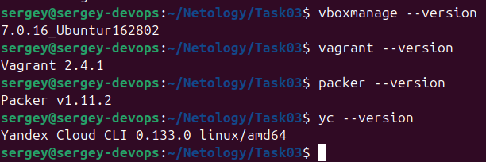
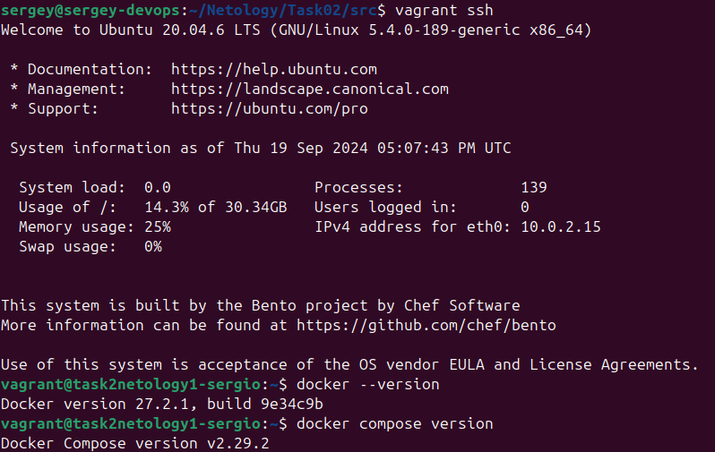
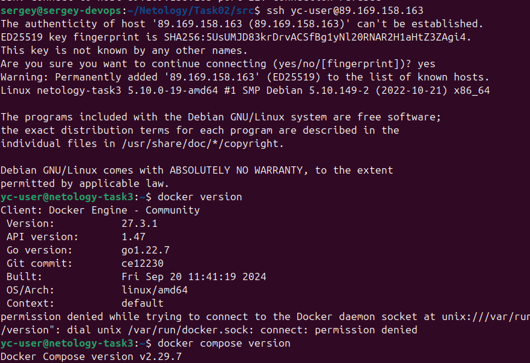

## 1

## 2

## 3

`cd src`

- Установить плагин:

`packer init yandex-plugin.pkr.hcl`

Создать образ
- Запустить:

`packer build --var-file=variables.json mydebian.pkr.hcl`

или

`packer build --var-file variables.json mydebian.json`

Создать виртуальную машину
- Заменить переменные окружения в create_yandex.vm
- Запустить `./create_yandex_vm`

- Войти:

`ssh yc-user@<ip>`

